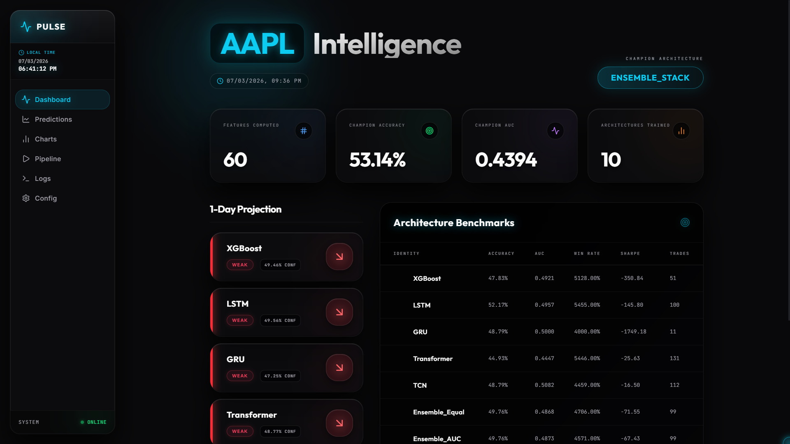
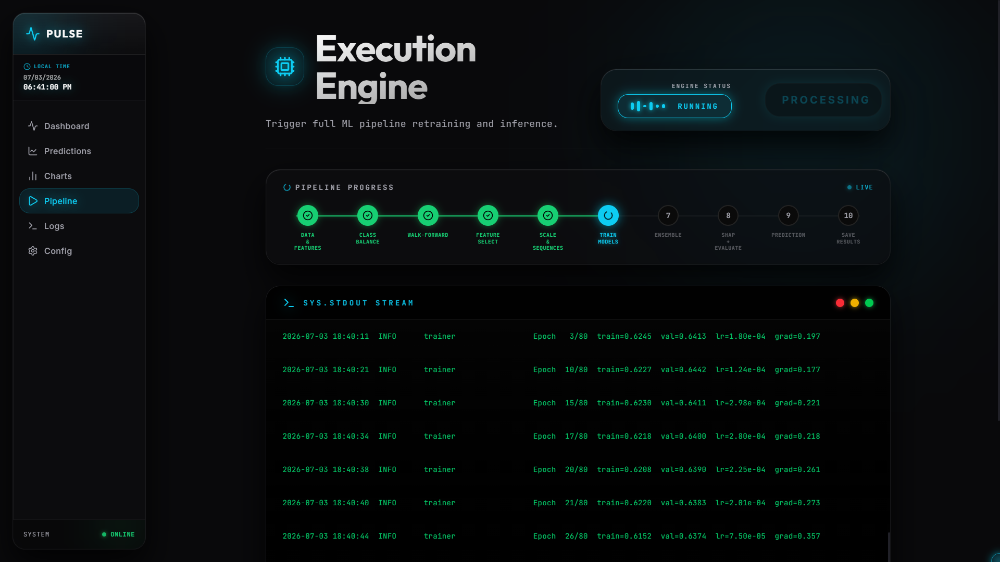
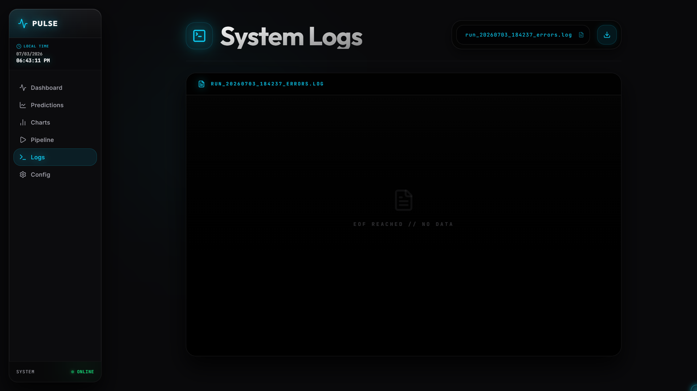
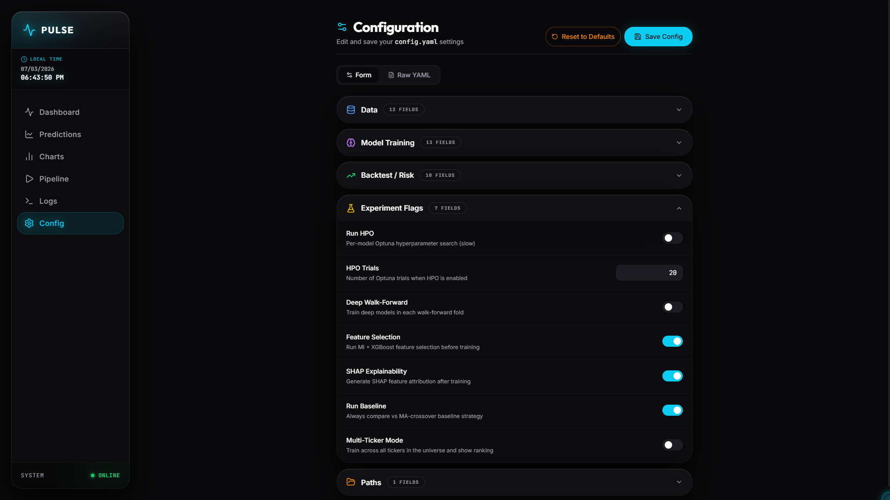
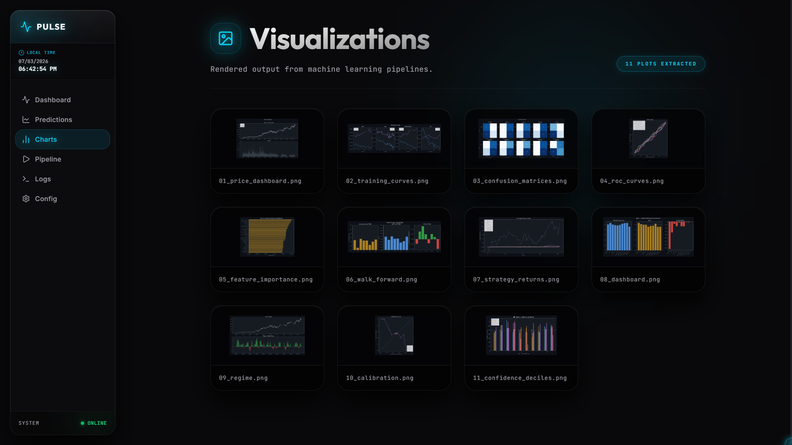
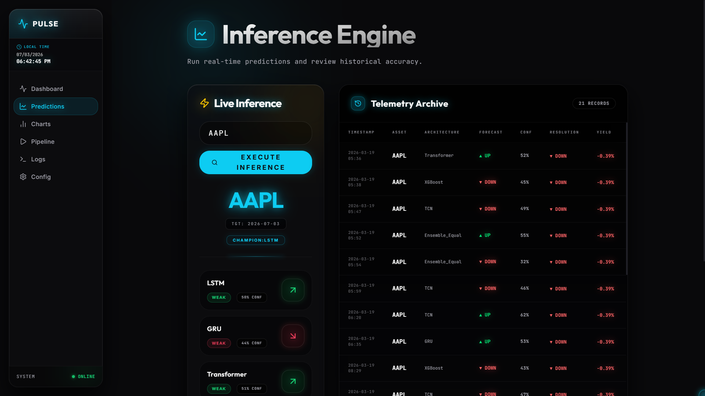

<div align="center">
  
# PULSE

**A Full-Stack Machine Learning Trading Dashboard**

[](https://www.typescriptlang.org/)
[](https://reactjs.org/)
[](https://www.python.org/)
[](https://pytorch.org/)

*Pulse is a command center for executing and analyzing machine learning pipelines for quantitative trading, wrapped in an ultra-premium, heavily stylized cinematic UI.*

</div>

---

## 1. Project Overview

**Pulse** is a fully integrated, monorepo-based machine learning pipeline and visual dashboard. 

**What it actually does:**
It provides a user interface to configure, execute, and monitor a suite of Python-based machine learning models (PyTorch and XGBoost) that predict stock market movements. It fetches historical data via Yahoo Finance, trains models, evaluates their performance, generates SHAP explainability charts, and serves the results to a stylized React frontend.

**Who it is for:**
Quantitative researchers, data scientists, or developers looking for a modern, visually immersive way to run and analyze automated ML trading experiments locally.

---

## 2. Verified Features

Based on codebase analysis, the project contains the following real functionality:

- **End-to-End Pipeline Execution**: Trigger a Python ML pipeline directly from the UI via a Node.js backend (`apps/ml_engine/main.py`).
- **Live Telemetry & Logs Streaming**: View real-time `stdout` from the Python engine in a stylized, auto-scrolling terminal (`logs.tsx`).
- **Dynamic Configuration Management**: Edit ML pipeline parameters (tickers, epochs, models) directly through a UI editor that modifies `config.yaml` (`config.tsx`).
- **Data & Chart Visualization**: View statically generated Matplotlib charts (ROC curves, SHAP waterfalls, confusion matrices, price history) served from the `/results` directory (`charts.tsx`).
- **Prediction Dashboards**: Read and display prediction metrics and ticker rankings from generated JSON/CSV artifacts (`dashboard.tsx`, `predictions.tsx`).

> **Note on "Music Player" / "Lyrics" UI Metaphor:** 
> The UI utilizes animations and layouts inspired by premium media players (using Framer Motion). There is no actual audio processing or music playback in this application; it is strictly a design metaphor for the execution engine and log scroller.

---

## 3. Tech Stack

**Frontend (`apps/web`):**
- **React 18** via **Vite**
- **TypeScript**
- **Tailwind CSS** (Styling & Glassmorphism)
- **Framer Motion** (Layout morphing and animations)
- **Wouter** (Routing)
- **Radix UI** (Unstyled accessible primitives)
- **Recharts** (Data visualization)

**Backend API (`apps/api`):**
- **Node.js** with **Express**
- **Zod** (Request/response validation)

**Machine Learning Engine (`apps/ml_engine`):**
- **Python 3.10+**
- **PyTorch** (LSTM, GRU, TCN, Transformer architectures)
- **XGBoost** (Gradient Boosting Decision Trees)
- **Pandas / NumPy / Scikit-learn** (Data processing)
- **yfinance** (Market data ingestion)
- **SHAP** (Model explainability)
- **Matplotlib** (Chart rendering)

---

## 4. Installation & Run Guide

### Prerequisites
1. **Node.js** (v18+)
2. **pnpm** (v11+)
3. **Python** (3.10+)

### Setup Instructions

**1. Install Node Dependencies**
```bash
# From the project root, install all monorepo packages
pnpm install
```

**2. Setup Python Environment**
```bash
# Create a virtual environment
python -m venv .venv

# Activate the virtual environment
# Windows:
.\.venv\Scripts\Activate.ps1
# Mac/Linux:
source .venv/bin/activate

# Install ML Engine dependencies
pip install -r apps/ml_engine/requirements.txt
```

**3. Configure Environment**
Copy `.env.example` to `.env` in the root directory. Ensure `PYTHON_BIN` points to your virtual environment's executable.
```env
PYTHON_BIN=.venv\Scripts\python.exe # Windows
# PYTHON_BIN=.venv/bin/python       # Mac/Linux
```

**4. Start the Application**
```bash
# Start both the API backend and the Vite Frontend concurrently
pnpm dev
```
The application will be available at **`http://localhost:5173`**.

---

## 5. Project Structure

The project utilizes a `pnpm` monorepo structure.

```text
pulse/
├── apps/
│   ├── api/                 # Express REST API (Triggers Python, serves files)
│   ├── ml_engine/           # Python ML Pipeline (yfinance, PyTorch, XGBoost)
│   └── web/                 # React Frontend (Vite, Tailwind)
├── packages/
│   ├── api-client-react/    # Auto-generated React Query client for the API
│   ├── api-zod/             # Shared validation schemas between frontend and backend
│   └── db/                  # Drizzle ORM configuration (Schema definitions)
├── results/                 # Auto-generated outputs from ML runs (Charts, JSON, Models)
├── config.yaml              # Global ML pipeline configuration
└── package.json             # Root monorepo configuration
```

---

## 6. 📸 Experience Showcase

<table align="center" style="border-collapse: separate; border-spacing: 15px;">
  <tr>
    <td align="center" width="50%">
      <h3>Dashboard Command Center</h3>
      <p><i>The central hub displaying model confidence and real-time market predictions.</i></p>
      
    </td>
    <td align="center" width="50%">
      <h3>Execution Engine</h3>
      <p><i>Pipeline execution interface reacting to ML training loops.</i></p>
      
    </td>
  </tr>
  <tr>
    <td align="center" width="50%">
      <h3>System Logs</h3>
      <p><i>Scrolling telemetry streaming stdout directly from the Python engine.</i></p>
      
    </td>
    <td align="center" width="50%">
      <h3>Pipeline Configuration</h3>
      <p><i>Real-time editable YAML parameters driving the ML engine.</i></p>
      
    </td>
  </tr>
  <tr>
    <td align="center" width="50%">
      <h3>Analytics & Visualizations</h3>
      <p><i>Rendered Matplotlib charts of model performance and SHAP values.</i></p>
      
    </td>
    <td align="center" width="50%">
      <h3>Inference Engine</h3>
      <p><i>Deep dark mode aesthetics featuring cinematic gradients.</i></p>
      
    </td>
  </tr>
</table>

---

## 7. Core Functionality Flow

1. **Configuration**: The user edits parameters via `/config` (updates `config.yaml`).
2. **Execution**: The user clicks "Execute" in `/run`.
3. **API Layer**: The frontend sends a POST request to the Node `apps/api`.
4. **Subprocess**: The API spawns `apps/ml_engine/main.py` as a child process using the `.venv` Python binary.
5. **Data & Training**: The Python script fetches market data (`yfinance`), engineers features, trains the configured models (XGBoost, LSTMs), runs SHAP, and saves all graphs/JSONs into the `/results` folder.
6. **Telemetry**: During training, the API intercepts `stdout` from Python and stores it in memory. The frontend polls `/api/ml/status` to animate the progress stepper and display scrolling logs in `/logs`.
7. **Review**: Once complete, the user navigates to `/dashboard` or `/charts`, where the frontend fetches and renders the newly generated static assets from the `/results` directory.

---

## 8. Notes & Limitations

- **Brokerage Integration**: *I cannot confirm real brokerage integration from the codebase.* The current pipeline fetches historical data and makes future predictions, but does **not** execute live financial trades on exchanges.
- **Database**: The `packages/db` folder contains Drizzle ORM schemas, but real-time database usage for storing predictions history appears minimally integrated or aspirational at this stage; predictions rely heavily on static flat files (`.csv`, `.json`) stored in `/results`.
- **Operating System Compatibility**: The backend utilizes cross-platform `path.resolve` logic for identifying the `.venv` Python binary, meaning it functions accurately on both Windows and Unix-based systems if `.env` is configured correctly.
